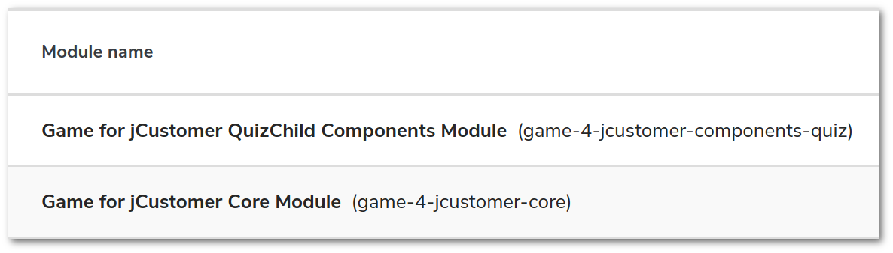
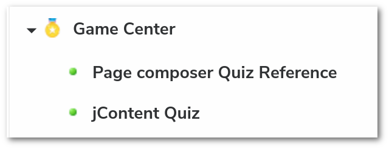

# Gamification experience
Gamification is a great marketing tool to enrich a visitor's profile. **jExperience** is a great
**[Customer Data Platform][cdp]** (a.k.a. CDP), **jContent** is a great **[Digital Experience Platform][dxp]**
(a.k.a. DXP) so let combine the power of both to create and run marketing game like Quizzes or Assessment tool.

This project present how to use the power of the Jahia suite to add gamification to the experience
of your visitor.

This project is composed by: 
* 3 main components:
    1. A [Core component][core.md] which contains configurations usable across multiple component
    1. A [Quiz component][quiz.md] which contains configurations and views to create, update and display
       Quizzes from jContent
    1. A standalone [React application][webapp.md] which is the quiz engine. This application consumes contents
       (quiz description, question & answers, warmup, video) from jContent and collects feedback for jExperience.
* 2 sample components:   
    1. A [Package builder][package.md] used to create a unique archive and deploy in one shoot the Core and the Quiz
    1. A [jCustomer plugin][jCust-plugin.md] sample code for a jCustomer custom action (not used)

## Overview
This project is a Jahia Accelerator. It presents implementation examples on
*how to deal with a headless application*.

### Features
The Quiz React webapp has 3 main features:
1. **Contributor oriented** : the webapp is fully editable and configurable from the jContent UI:
    * Quiz description, question & answers, warmup, video, background image (*editorial content*). 
      Media content can be added from a third party DAM or the local jContent Media repository
    * Static content like button label, css style, transition fx (*configuration content*).
1. **User Experience oriented** : The webapp can synchronize user responses with its CDP user profile
   (jExperience) and the user can have a personalized result page. User profile data can also be used to personalized
   your website content thereafter.
1. **Multichannel oriented** : The Quiz webapp can be added in your jahia website in few seconds. But,
   as a standalone application it can also be embedded via iframe or via a template in your favorite CMS.
   Contribute and personalize in Jahia, broadcast where you want.

### Data flow schema
The React quiz webapp get editorial and configuration content from jContent.
The module interact also with jExperience to enhanced user profile and improve content
personalization.

![010]

1. Marketeers create Quiz content from jContent and publish it. Thereafter, they have 2 options, embed the Quiz
in a website managed by Jahia, or start a standalone Quiz webapp.
2. A visitor visits the web page with the Quiz.
3. The Quiz webapp interact with jContent to get the content and configuration of the Quiz.
4. (optional) When a user answers a question the webapp send an event to store the answer in a CDP user
profile attribute.
5. The last step of the Quiz is the page result. If there is a personalized content to display, the webapp get
this content from a GraphQL call to jExperience.
6. To calculate the score of the user, jExperience synchronize with jCustomer.
7. For each step of the Quiz the html page is render to the user.

<!-- The jahia Assessment Tool module is an good usage example of this module --> 
## QuickStart
### Prerequisite
This module needs
* widen-picker >= 2.2.0
* codemirror-editor >= 1.1.2
* jexperience >= 2.1.0

### Install
1. In jContent, go to `Administration` panel.
2. In the `Server` section expand the `Modules and Extensions` entry and click `Modules`.
3. From the right panel, click `Available modules` and search for **gam**.

   ![101]

1. Click the icon ![201] in the right of the package to download and install the module

The module is a package, therefore, it uploads and deploys 2 modules :
* game-4-jcustomer-components-quiz
* game-4-jcustomer-core
![102]

<!--

 --> 
Before to create a Quiz in your site you must enable game-4-jcustomer-components-quiz for your project.
![103]

Now your can to create a Quiz in jContent or create a Quiz Reference in Page composer.

To know more about Quiz creation [Read this dedicated page][quiz.md]

[010]: doc/schema/010archi.png
[101]: doc/images/101_storeInstall.png
[102]: doc/images/102_storeInstalled.png
[103]: doc/images/103_enableQuiz.png
[201]: doc/images/201_modules_download_icon.png
[comment]: <> ([100]: doc/images/100_modules.png)
[comment]: <> ([200]: doc/images/200_contentToCreate.png)
[comment]: <> ([202]: doc/images/202_subContent.png)

[core.md]: game-4-jcustomer-core/README.md
[quiz.md]: game-4-jcustomer-components-quiz/README.md
[webapp.md]: game-4-jcustomer-components-quiz-react/README.md
[package.md]: game-4-jcustomer-package/README.md
[jCust-plugin.md]: game-4-jcustomer-plugin/README.md

[dxp]: https://en.wikipedia.org/wiki/Digital_experience_platform
[cdp]: https://en.wikipedia.org/wiki/Customer_data_platform