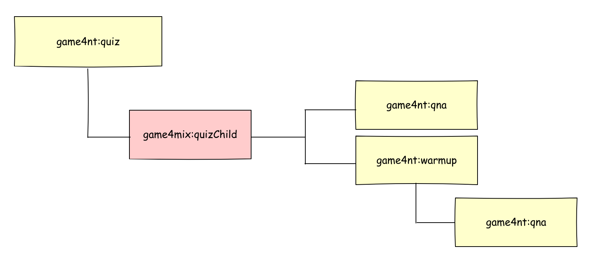

# Quiz experience

The quiz component is part of the Gamification Experience project. To know more about
the full component of the project [read this page][overview.md].

## Overview

This module is used to configure Jahia as a backend of the Quiz React webapp.
Also, it contains :
* The content definition of **Quiz**, **Warmup**, **Question & Answer**,
and **Quiz Reference** (see the [definitions.cnd] file.), and the JSON
**selectorType configurations** (see [the folder][selector_conf]).
* A **custom selectorType** ([QnAJson]) used to manage 3 related properties and store 
the result as a JSON into a Jahia String property.
* **Views** for **Quiz** (see [quiz views folder][quizViews]),
and **Quiz Reference** (see [quiz reference views folder][quizRefViews]).
Note, the default view for the Quiz embed the Quiz React webapp code.
* The build of the **Quiz React webapp** (see [the folder][quiz_webapp])
* A **drools rule** (see [the code][d_rule]) which create automatically a jExperience user profile based
on the quiz key. This property is used to store the score that a user obtains
at the end of a quiz. Then marketeers can create personalization rule based
on this score to personalize the content displayed to the user.
* A set of **configuration files for jExperience** to create automatically 
user profile properties and rules (see [the folder][jExp_conf])

## Module in details

### Node Type definitions and views
One feature of this module is to be **Contributor oriented**. That means,
the Quiz webapp must be fully editable and configurable from the jContent UI.
The marketeer must be able to create at least a Quiz content and its related children
like a Warmup content or a Question & Answer content (QnA). Moreover, they must also be able to translate
these contents, to order them, to remove one of them and more.
But to be really contributor oriented, the marketeer must also be able to :
* Override the static labels used in the application (like "start" button).
* Enable a marketo form before to start the quiz.
* Synchronize user response with the CDP jExperience.
* Use a personalized content to present user results.
* Enable/disable transition between slides.
* Override some part of the application `theme`.

All of these requirements can be achieved with a well configured Jahia backend.

#### overview
The nodeTypes and mixins written in the [definitions.cnd] file are defined to create the best Jahia
backend.
The main goal of this module is to create Quizzes and a quiz (`game4nt:quiz`) has two types of children:
1. Warmup (`game4nt:warmup`) used to introduce a set of QnA. A warmup can display a text or a video to provide information
 or to introduce the context of coming questions.
2. QnA (`game4nt:qna`) used to ask a question and to display a set of response.

The hierarchy between the mixins and node types is presented in the schema below:



#### game4nt:quiz
This nodeType is the main entry of a Quiz and the only one type a user can create directly in jContent.
the nodeType support the Quiz title, subtitle, description and other editorial content, but also the
webapp configuration.
##### Definition
This node type is defined like this:
```cnd
[game4nt:quiz] > jnt:content, game4mix:components, game4mix:showInTree, game4mix:usesConsents, wdenmix:mediaReference,game4mix:quizConfiguration,game4mix:marketingFormReference, mix:title, game4mix:quizStaticLabels orderable
 - game4:quizKey (string) primary mandatory
 - game4:subtitle (string) internationalized
 - game4:description (string, richtext[ckeditor.toolbar='Tinny',ckeditor.customConfig='$context/modules/game-4-jcustomer-components-quiz/javascript/ckeditor/config/small.js']) internationalized
 - game4:duration (string,choicelist[resourceBundle]) = '5 mins' autocreated indexed=no < '5 mins', '10 mins', '30 mins', '1h' , '> 1h'
 - game4:personalizedResultContent (weakreference, choicelist[nodes='$currentSite//*;wemnt:personalizedContent'])
 + * (game4mix:quizChild)
```

To be flexible and to have the capability to add Warmup and QnA in the order we want and the number
we want, we use as child type the mixin `game4mix:quizChild`

`game4nt:quiz` extends 9 supertypes:
1. `jnt:content` meaning the node type is a content node type.
2. `game4mix:components` meaning the node type appears in the **Game Center** menu entry.
This mixin is defined in the core module (see the core [defnition.cnd][core_cnd]).
3. `game4mix:showInTree` meaning the node is visible in the jContent tree
4. `game4mix:usesConsents` meaning the contributor can select jExperience consent that user must
approve before to start the quiz.
5. `wdenmix:mediaReference` meaning the contributor can select a background for the Quiz 'slide' coming
from jContent Media repository or from Widen Dam if the contributor has a licence with them.
6. `game4mix:quizConfiguration`
7. `game4mix:marketingFormReference`
8. `game4mix:quizStaticLabels`
9. `mix:title`

###### Mixins
###### game4mix:quizStaticLabels
###### game4mix:quizConfiguration
###### game4mix:marketingFormReference
###### wdenmix:mediaReference
###### game4mix:usesConsents

##### Views

### The Custom selectorType QnAJson.jsx
### The drools rule


  When you have a quiz create you can create subcontent like *Question and Answer* (Qna) and *Warmup*


[overview.md]: ../README.md
[definitions.cnd]: ./src/main/resources/META-INF/definitions.cnd
[quizViews]: ./src/main/resources/game4nt_quiz/html
[quizRefViews]: ./src/main/resources/game4nt_quizReference/html
[d_rule]: ./src/main/resources/META-INF/rules.drl
[quiz_webapp]: ./src/main/resources/javascript/webapp
[QnAJson]: ./src/javascript/QnAJson
[jExp_conf]: ./src/main/resources/META-INF/jexperience
[selector_conf]:  ./src/main/resources/META-INF/jahia-content-editor-forms/fieldsets
[core_cnd]: ../game-4-jcustomer-core/src/main/resources/META-INF/definitions.cnd